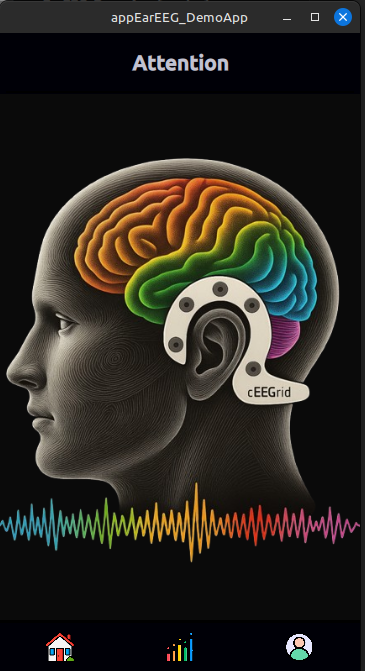
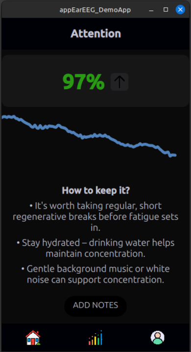
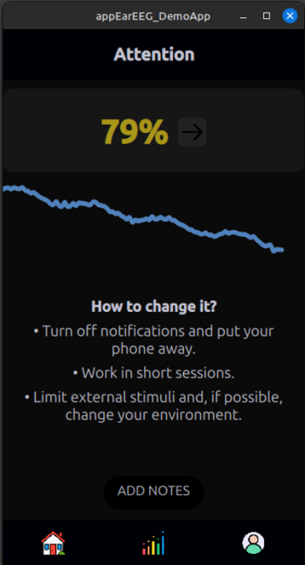
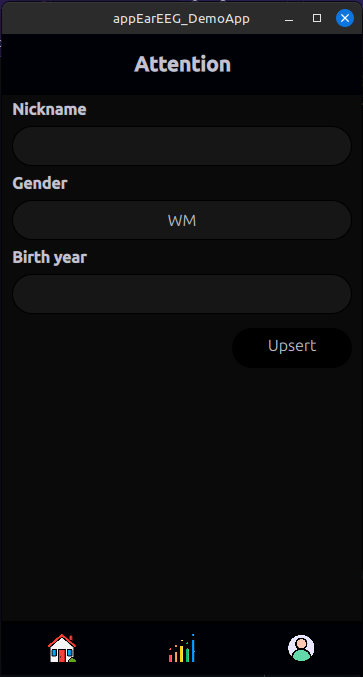

# EarEEG — Demo App for Daily Focus Tracking  

**Project description**  
A lightweight **mobile demo application** that visualizes **focus level** in real time using simulated earEEG signals. The app is a prototype for future integration with real hardware.  

We chose to build this demo because **earEEG** technology allows convenient and mobile recording of brain activity. Unlike traditional EEG, it can be worn daily and unobtrusively, making it an excellent tool for studying focus during real-world tasks (e.g., reading, listening, working).  

## App examples

<p align="center">
  
  
  
  
</p>

## Content
- [Project presentation](./README.md#project-presentation)
- [Roadmap](./README.md#roadmap)
- [How to run the app](./README.md#how-to-run-the-app)
  - [Environment](./README.md#environment)
  - [Used technologies](./README.md#used-technologies)
  - [Run the app](./README.md#run-the-app)
- [Contact](./README.md#contact)

## Project presentation
Details of the project (with app examples) are available [here](./doc/presentation.pdf)

## Current features  
The prototype already includes:  
- 📱 **User Interface (UI)** – visualization of focus level with simple charts and feedback  
- 🗄️ **SQLite integration** – automatic creation of required tables for storing data  
- 🧠 **Biofeedback & recommendations** – app reacts to focus level and suggests micro-actions  

## Roadmap  
Next development steps:  
- ☁️ Enable **secure cloud storage** of data (Supabase or other) 
- ⚡ Simulates earEEG input for testing without real hardware  
- 📦 Create infrastructure for chunked data processing  
- 🔗 Connect with **real earEEG hardware**  
- 📊 Improve signal processing (FFT, band power analysis, entropy measures)
- 📱 Extend the mobile UI with **recommendations & history view**  

## How to run the app
### Environment
- 🐧 **Linux** (tested on Linux Mint 21/22)  
- 📱 **SDK emulator** for mobile builds (Android)  
- 💻 Desktop build & run via **Qt Creator**  

### Used technologies 
- 🎨 **QML** – modern, declarative UI  
- 💻 **C++** – backend logic, data streams, signal processing  
- 🏗️ **CMake** – build system configuration  
- 🗄️ **SQLite** – lightweight local database for persistent storage

### Run the app
Download files from GitHub and open project in Qt Creator
```
git clone https://github.com/humanplusplus/EarEEG_DemoApp
```

## Contact
If you are interested in collaboration, research, or supporting development, feel free to reach out ✉️ humannnplusplus[at]gmail.com

